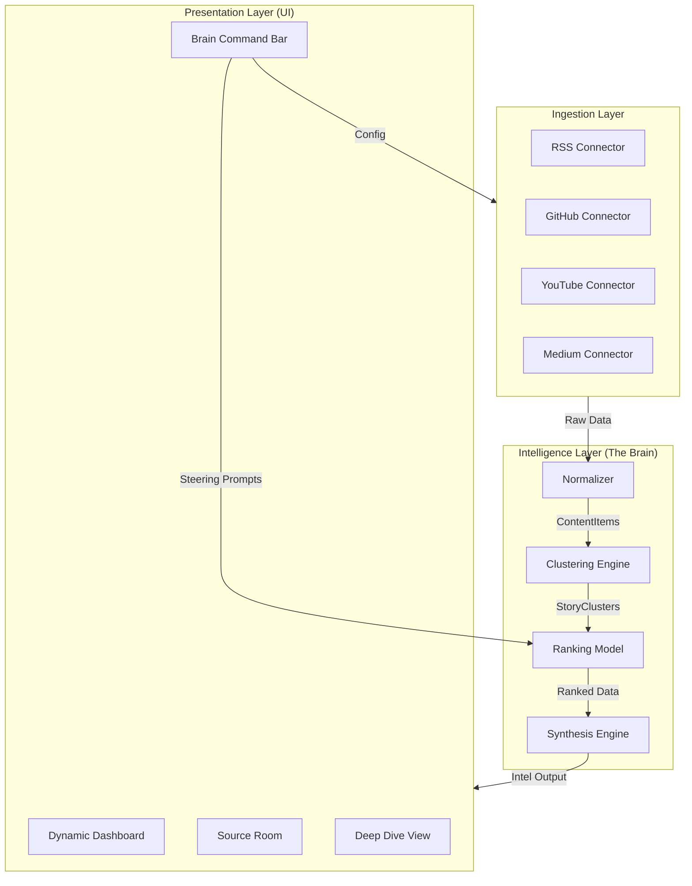

# Technical Specification: Dream News

## 1. System Architecture

The system is designed with a **Modular Separation of Concerns** to ensure that any component (Ingestion, Brain, UI) can be evolved or replaced independently.



## 2. Component Breakdown

### A. Ingestion Architecture (Connector Pattern)

Every source implements a standard Interface:

```typescript
interface Connector {
  discover(): Promise<RawItem[]>;
  hydrate(id: string): Promise<FullContent>;
  normalize(raw: RawItem): ContentItem;
}
```

- **RSS**: Standard XML parser.
- **YouTube**: Transcript fetcher.
- **Medium/Dev.to**: Scraping or API-based fetcher.

### B. Canonical Intelligence Pipeline (Steerable & Interchangeable)

The system processes data in strictly ordered stages. Each stage is an interchangeable module implementing a **Steerable Interface**:

```typescript
interface SteerableComponent<TInput, TOutput> {
  process(input: TInput, context: SteeringContext): Promise<TOutput>;
}

interface SteeringContext {
  globalStrategy: string; // Current focus (e.g., "Deep tech priority")
  componentPrompts?: string[]; // Specific overrides for this stage
  parameters: Record<string, any>; // Numeric weights/thresholds
}
```

#### Pipeline Stages:

1.  **Ingest**: Collect raw items via Connector `discover()`.
2.  **Hydrate**: Fetch full text/transcripts.
3.  **Normalize**: Map to canonical `ContentItem` schema.
4.  **Dedupe**: Exact/near-duplicate detection (Thresholds steerable by Brain).
5.  **Embed**: Vector generation.
6.  **Cluster**: Semantic grouping (Granularity steerable by Brain).
7.  **Score**: Rank items + clusters (Weights steerable by User/Brain).
8.  **Summarize**: Multi-level synthesis (Persona/Style steerable by Brain).
9.  **Publish**: Render and distribute.

### C. The “Brain” Orchestrator

The Brain acts as the **System Conductor**. It translates high-level user prompts (from the Steering Bar) into specific `SteeringContext` for each pipeline stage.

- **Example**: If the user says _"I'm in a hurry, give me just the facts"_, the Brain adjusts:
  - **Summarize Stage**: Pass prompt "Use extremely concise bullet points".
  - **Score Stage**: Boost "Read Time" weight to favor short items.
  - **Dedupe Stage**: Tighten similarity threshold to minimize repetition.

The Brain also produces the primary outputs:

- **Daily Narrative**: The "Macro" summary of the day.
- **Top Clusters & Canonical Items**: The primary ranked output.
- **“Edge” Items**: Content intentionally selected to probe boundaries.

### D. Output Renderers

- **Email Renderer**: Optimized for mobile, short, and scannable snippets.
- **Dashboard Renderer**: Dynamic high-contrast cards, clusters, and ranking explanations.

### C. UI Framework (The Terminal)

- **Framework**: Next.js 15 (App Router).
- **Styles**: Tailwind CSS + Framer Motion (for dynamic transitions).
- **State Management**: React Context or Zustand for "Steering" states.
- **The "Dynamic View"**: A layout that swaps section themes (Charcoal/White) as the user scrolls.

## 3. Data Flow

- **Ingestion**: Daily cron job or serverless function.
- **Storage**: JSON-based (V1) or Supabase (V2).
- **Feedback Loop**: Steering prompts from the UI affect the `Ranking Model` weights in real-time.

## 4. UI Compartmentalization

Each UI section is a self-contained component:

- `<IntelSummary />`: The Dark Hero component.
- `<TopicStream category="TECH" />`: The Light Body modular grid.
- `<SourceCollection />`: The grid of Source Entity cards.
- `<KnowledgeGraph />`: The SVG-based node visualizer.
