# Technical Specification: Heartbeat Monitoring API

| Field | Value |
|-------|-------|
| **Feature ID** | FEAT-HEARTBEAT-001 |
| **Based On** | docs/requirements/REQ-NSO-Heartbeat-API.md |
| **Status** | Pending Approval |
| **Created** | 2026-02-07 |
| **Oracle** | OpenCode |

---

## 1. Architecture Overview

```mermaid
flowchart TB
    subgraph User_Interaction
        U["👤 User"]
        H["/heartbeat command"]
    end

    subgraph Script_Execution
        S["🐍 scripts/heartbeat_api.py"]
        HS["HTTP Server\nPort 8080"]
    end

    subgraph Data_Source
        TF[".opencode/logs/\ntask_status.json"]
    end

    U -->|"Runs"| H
    H -->|"Spawns"| S
    S -->|"Creates"| HS
    HS -->|"Reads"| TF

    style U fill:#e1f5fe
    style H fill:#fff3e0
    style S fill:#e8f5e9
    style HS fill:#fce4ec
    style TF fill:#f3e5f5
```



**How It Works:**
1. User types `/heartbeat` to start monitoring
2. Script spawns an HTTP server on port 8080
3. Server exposes `/api/health` endpoint
4. Endpoint reads agent status from task_status.json

---

## 2. Component Specification

### 2.1 Script: `scripts/heartbeat_api.py`

| Property | Value |
|----------|-------|
| **Language** | Python 3.12+ |
| **Dependencies** | None (uses built-in `http.server`) |
| **Entry Point** | `if __name__ == "__main__": main()` |
| **Port** | 8080 |

#### 2.1.1 Module Structure

The script is organized into **three layers**:

```
┌─────────────────────────────────────────┐
│  Layer 1: Entry Point (main)            │
│  - Server initialization               │
│  - Signal handling (Ctrl+C)             │
└────────────────┬────────────────────────┘
                 │
                 ▼
┌─────────────────────────────────────────┐
│  Layer 2: HTTP Handler                  │
│  - Route matching (/api/health)         │
│  - Request dispatching                  │
│  - Response building                    │
└────────────────┬────────────────────────┘
                 │
                 ▼
┌─────────────────────────────────────────┐
│  Layer 3: Data Access                   │
│  - Read status file                     │
│  - Parse JSON                           │
│  - Error handling                       │
└─────────────────────────────────────────┘
```

**Layer Details:**

| Layer | Components | Responsibility |
|-------|------------|----------------|
| **1. Entry Point** | `main()` | Starts HTTPServer, prints startup message, handles graceful shutdown |
| **2. HTTP Handler** | `HeartbeatHandler` | Routes GET requests, builds JSON responses, handles errors |
| **3. Data Access** | `_load_agents()` | Reads `.opencode/logs/task_status.json`, returns agent dict |

**Key Design Decisions:**
- **Single Responsibility**: Each layer has one job
- **Easy Testing**: Layers can be tested independently
- **Error Isolation**: Failures in data layer don't crash the server

#### 2.1.2 Functions (Atomic, Max 50 Lines)

| Function | Lines | Purpose |
|----------|-------|---------|
| `main()` | ~10 | Entry point, starts server |
| `HeartbeatHandler.do_GET()` | ~5 | Routes GET requests |
| `HeartbeatHandler._handle_health()` | ~10 | Processes health endpoint |
| `HeartbeatHandler._load_agents()` | ~8 | Reads status file |
| `HeartbeatHandler._build_response()` | ~10 | Formats JSON output |
| `HeartbeatHandler._send_json()` | ~6 | Sends HTTP response |

---

### 2.2 Slash Command: `/heartbeat` in `opencode.json`

| Property | Value |
|----------|-------|
| **Command** | `/heartbeat` |
| **Description** | Start the heartbeat monitoring API |
| **Action** | Spawns `python scripts/heartbeat_api.py` |

```json
{
  "command": {
    "heartbeat": {
      "description": "Start the heartbeat monitoring API",
      "template": "Run 'python scripts/heartbeat_api.py' in a new terminal session",
      "agent": "Oracle",
      "spawn": true
    }
  }
}
```

---

## 3. Data Flow


### 3.1 Request: `GET /api/health`

| Step | Action |
|------|--------|
| 1 | HTTP Server receives request on port 8080 |
| 2 | Handler checks path == "/api/health" |
| 3 | `_load_agents()` reads `.opencode/logs/task_status.json` |
| 4 | `_build_response()` formats JSON with timestamp |
| 5 | `_send_json()` returns HTTP 200 with body |

### 3.2 Response Structure

```json
{
  "status": "healthy",
  "timestamp": "2026-02-07T12:00:00Z",
  "agents": {
    "oracle": {
      "status": "running",
      "current_step": "Drafting requirements",
      "last_heartbeat": 1707312000.5
    }
  }
}
```

| Field | Type | Description |
|-------|------|-------------|
| `status` | string | Always "healthy" if server is running |
| `timestamp` | ISO 8601 | Server UTC time |
| `agents` | object | Agent IDs as keys, status objects as values |

---

## 4. Error Handling

| Scenario | Behavior | HTTP Code |
|----------|----------|-----------|
| Status file missing | Return `{}` for agents | 200 |
| Malformed JSON in status file | Return error message | 500 |
| Invalid path | Return 404 | 404 |
| Server startup failure | Print error, exit | N/A |

---

## 5. Traceability Matrix

| Requirement | Implementation File | Traceability Tag |
|-------------|--------------------|--------------------|
| FR-001 | `scripts/heartbeat_api.py` | `// @implements: FR-HEARTBEAT-001` |
| FR-002 | `scripts/heartbeat_api.py` | `// @implements: FR-HEARTBEAT-002` |
| FR-003 | `scripts/heartbeat_api.py` | `// @implements: FR-HEARTBEAT-003` |
| FR-004 | `scripts/heartbeat_api.py` | `// @implements: FR-HEARTBEAT-004` |
| FR-006 | `scripts/heartbeat_api.py` | `// @implements: FR-HEARTBEAT-006` |
| FR-007 | `scripts/heartbeat_api.py` | `// @implements: FR-HEARTBEAT-007` |
| FR-008 | `scripts/heartbeat_api.py` | `// @implements: FR-HEARTBEAT-008` |
| FR-009 | `opencode.json` | `// @implements: FR-HEARTBEAT-009` |

---

## 6. Testing Strategy

| Test Type | Tool | Coverage Target |
|-----------|------|----------------|
| Unit Tests | pytest | Functions (_load_agents, _build_response) |
| Integration | curl | Full HTTP endpoint |
| Manual | - | Script startup/shutdown |

---

## 7. Security Considerations

- **Public Access**: No authentication (as specified in FR-008)
- **Path Traversal**: Not possible (only `/api/health` accepted)
- **Data Exposure**: Only agent IDs and status (no PII)
- **Port Exposure**: Binds to localhost:8080 by default

---

## 8. Future Extensions (Not Implemented)

| Extension | Rationale |
|-----------|-----------|
| System metrics (CPU/memory) | Requires new dependency (psutil) |
| Authentication layer | Contradicts FR-008 |
| HTTPS | Out of scope for V1 |

---

## 9. Architecture Review Log

### Review 1: Simplicity Check
- **Question**: Can this be done with fewer moving parts?
- **Answer**: Yes. Using Python's built-in `http.server` eliminates all external dependencies. The script is self-contained.
- **Result**: ✅ Pass

### Review 2: Modularity Check
- **Question**: Are boundaries clear? Can the DB be replaced?
- **Answer**: Yes. The `_load_agents()` function is isolated. It can be swapped to read from a different source without changing the HTTP handler.
- **Result**: ✅ Pass

### Review 3: Abstraction Check
- **Question**: Are we leaking implementation details?
- **Answer**: No. The HTTP handler is abstracted. Users see only `/api/health`. Internal JSON structure is hidden.
- **Result**: ✅ Pass

### Review 4: YAGNI Check
- **Question**: Are we building for a future that might not happen?
- **Answer**: No. We implement exactly what's requested. System metrics and auth are explicitly deferred.
- **Result**: ✅ Pass

---

## 10. Approval

| Role | Name | Status | Date |
|------|------|--------|------|
| Oracle | OpenCode | Draft | 2026-02-07 |
| User | [Name] | ⬜ Pending | - |

---

**Document Version:** 1.1.0
**Next Phase:** Development (Phase 3) - upon user approval
