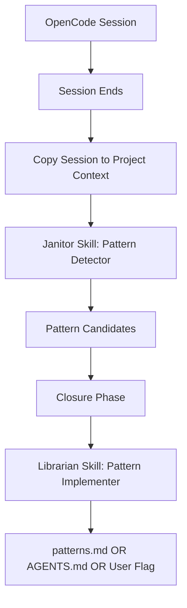
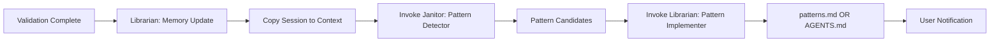

# Architecture: NSO Self-Improvement Automation

**Tech Spec ID:** TECHSPEC-NSO-Self-Improvement
**Status:** ARCHITECTURE (Draft - Simplified)
**Version:** 0.2.0
**Date:** 2026-02-07

## 1. Overview

### 1.1 Purpose
Design a system where NSO learns from its operations and improves automatically through skills, not complex scripts.

### 1.2 Key Insight from User
> "Don't create complex Python scripts. Use OpenCode's own logging. Use skills for analysis and implementation."

### 1.3 CC10x Reference
CC10x uses a **session-memory skill** for memory persistence and skills for self-improvement analysis. They don't have complex logging scripts.

## 2. Architecture (Simplified)



### What Changes

| Old Architecture | New Architecture |
|-----------------|------------------|
| `session_logger.py` (complex script) | ❌ REMOVED - Use OpenCode session |
| `session_log_analyzer.py` (Python script) | ✅ Janitor Skill (LLM-based) |
| `librarian_pattern_implementer.py` (Python script) | ✅ Librarian Skill (LLM-based) |
| Custom log format | ✅ OpenCode session format |

## 3. Triggers and Integration

### 3.1 Session End Trigger

```
When does the session get captured?
    ↓
OpenCode provides session context at:
    - Every tool call
    - Every phase transition
    - Every workflow end
    
We need: Copy session to .opencode/logs/session.json at workflow end
```

### 3.2 Janitor Trigger

```
When does Janitor analyze the session?
    ↓
At Closure Phase, Librarian triggers Janitor with:
    - "Analyze this session log for patterns"
    - Focus on: repeated failures, bypasses, validation patterns
```

### 3.3 Librarian Trigger

```
When does Librarian implement patterns?
    ↓
After Janitor provides pattern candidates:
    - Review each pattern
    - Categorize: agent-specific OR general
    - Implement: patterns.md OR AGENTS.md OR flag user
```

## 4. Component Design

### 4.1 Session Capture (Minimal Script)

Only one small script needed to copy OpenCode's session to project context:

```python
#!/usr/bin/env python3
"""
Copy OpenCode session to project context.

This is the ONLY script needed. Everything else is done via skills.
"""

import json
import sys
from pathlib import Path

def copy_session():
    """Copy session to project context."""
    # Where OpenCode stores session - this needs investigation
    #可能是 .opencode/logs/ or OpenCode server location
    
    session_source = Path(".opencode/logs/session.json")
    session_dest = Path(".opencode/logs/session.json")
    
    if session_source.exists():
        # Copy for Janitor to analyze
        import shutil
        shutil.copy(session_source, session_dest)
        print("✅ Session copied for analysis")
    else:
        print("⚠️ Session not found")
```

**This is the ONLY trigger script needed.**

### 4.2 Janitor Skill: Pattern Detector

A skill that uses LLM to analyze session and detect patterns:

```markdown
# Pattern Detector Skill (Janitor)

## Purpose
Analyze session log and detect improvement patterns.

## Inputs
- Session log from `.opencode/logs/session.json`
- Current patterns.md for context

## Outputs
Pattern candidates in structured format:

```json
{
  "patterns": [
    {
      "type": "repeated_failure",
      "description": "...",
      "evidence": ["..."],
      "severity": "medium",
      "recommendation": "Add to patterns.md"
    }
  ]
}
```

## Process
1. Load session log
2. Analyze for:
   - 3+ identical tool failures
   - Agent bypasses (dangerous!)
   - Recurring validation errors
   - Gate failures
3. Categorize each pattern
4. Output pattern candidates

## Example Analysis
```
Session shows: npm install failed 3 times in /frontend
LLM Analysis: "Agent tried npm install in wrong directory,
              failed, then succeeded from root.
              Pattern: Always run npm install from project root."
```

## Triggers
- Called by Librarian at Closure phase
```

### 4.3 Librarian Skill: Pattern Implementer

A skill that implements patterns based on Janitor's analysis:

```markdown
# Pattern Implementer Skill (Librarian)

## Purpose
Implement pattern improvements from Janitor's analysis.

## Inputs
- Pattern candidates from Janitor
- Current patterns.md
- Current AGENTS.md

## Outputs
- Updated patterns.md (general patterns)
- Updated AGENTS.md (agent-specific patterns)
- User notification (dangerous bypasses)

## Process
1. Review each pattern candidate
2. Categorize:
   - **Agent-specific**: Only affects one agent → Update AGENTS.md
   - **General**: Affects multiple agents → Update patterns.md
   - **Dangerous bypass**: Flag for user immediately
3. Implement: Write improvements
4. Notify user of changes

## Triggers
- Called by Librarian at Closure phase
```

## 5. Integration with Workflows

### 5.1 Closure Phase Update



Updated Closure phase in workflows:

```yaml
Closure (Librarian)
  1. Memory update (existing)
  2. Copy session to .opencode/logs/session.json
  3. Invoke Janitor Skill: Pattern Detector
  4. Review pattern candidates
  5. Invoke Librarian Skill: Pattern Implementer
  6. Notify user of new patterns
```

## 6. Open Questions

1. **Where does OpenCode store session?**
   - Need to investigate: `.opencode/logs/` or OpenCode server?

2. **How to invoke skills from Librarian?**
   - Use `task()` tool with Janitor/Librarian agents?

3. **What session format does OpenCode use?**
   - JSON? Text? Need to check.

## 7. File Structure

```
.opencode/
├── logs/
│   ├── session.json           # OpenCode session (copy from source)
│   └── session_archive_*.json # Archived sessions
├── skills/
│   ├── pattern-detector/     # Janitor skill (NEW)
│   │   └── SKILL.md
│   └── pattern-implementer/  # Librarian skill (NEW)
│       └── SKILL.md
├── context/
│   └── 01_memory/
│       ├── patterns.md       # General patterns (updated by skill)
│       └── active_context.md # Updated by Librarian
└── scripts/
    └── copy_session.py      # Only script needed (NEW)
```

## 8. Implementation Plan

### Phase 1: Session Copy Script
1. Create `copy_session.py`
2. Investigate OpenCode session location
3. Test copying session to project context

### Phase 2: Janitor Skill
1. Create `pattern-detector/SKILL.md`
2. Define prompt for pattern analysis
3. Test with sample session

### Phase 3: Librarian Skill
1. Create `pattern-implementer/SKILL.md`
2. Define prompt for pattern implementation
3. Test with sample patterns

### Phase 4: Workflow Integration
1. Update Closure phase in BUILD.md, DEBUG.md, REVIEW.md
2. Add session copy step
3. Add skill invocation

## 9. Acceptance Criteria

1. [ ] Single script copies session to project context
2. [ ] Janitor skill analyzes session for patterns
3. [ ] Librarian skill implements patterns
4. [ ] General patterns → patterns.md
5. [ ] Agent-specific patterns → AGENTS.md
6. [ ] Dangerous bypasses → User flagged
7. [ ] Zero complex logging scripts
8. [ ] Skills do all analysis (no Python scripts for logic)

## 10. Related Documents

- REQ-NSO-Self-Improvement.md (requirements)
- CC10x: session-memory skill (reference)
- AGENTS.md (agent prompts)
- patterns.md (existing patterns)

---

## Key Differences from Previous Architecture

| Previous (v0.1.0) | Current (v0.2.0) |
|-------------------|-------------------|
| `session_logger.py` (100+ lines) | ❌ Removed |
| `session_log_analyzer.py` (150+ lines) | ✅ Janitor Skill |
| `librarian_pattern_implementer.py` (100+ lines) | ✅ Librarian Skill |
| Custom log format | ✅ OpenCode session format |
| Complex Python logic | ✅ LLM-based skills |
| Multiple trigger scripts | ✅ Single copy script |

**This architecture is simpler, maintainable, and uses skills for intelligence.**
