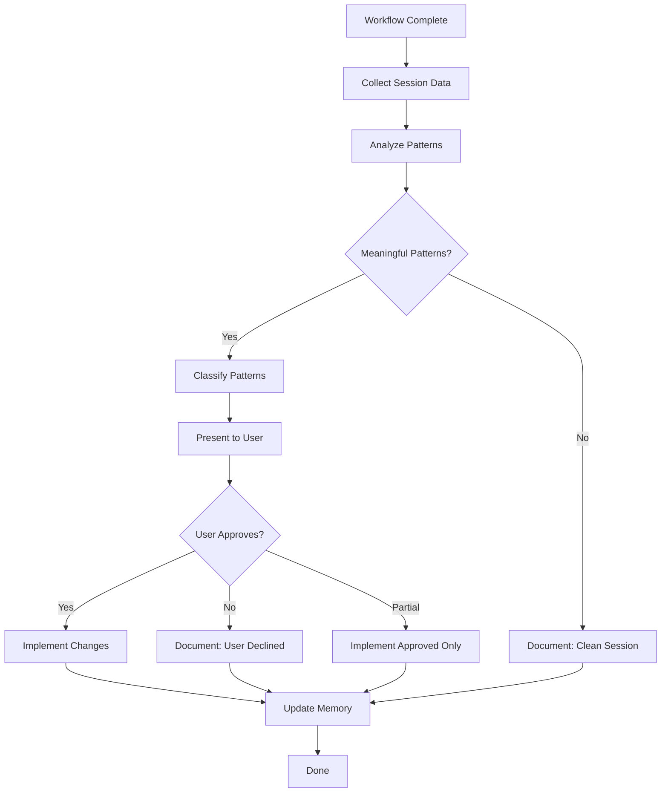

# Post-Mortem — Session Analysis & Self-Improvement Skill

**Agent:** Librarian (orchestrator)
**Phase:** Closure (Phase 5 in BUILD, Phase 4 in DEBUG/REVIEW)
**Priority:** MANDATORY — Runs at the end of every completed workflow
**Consolidates:** self-improve, pattern-detector, intelligent-pattern-detector, pattern-implementer

---

## IRON LAW

**EVERY COMPLETED WORKFLOW GETS A POST-MORTEM. NO EXCEPTIONS.**

Even if the workflow was perfect. Especially if the workflow was perfect — document WHY it worked so we can replicate it.

---

## Purpose

Run the complete self-improvement cycle at workflow closure:
1. Collect session data
2. Detect meaningful patterns (not noise)
3. Classify: real issues vs. normal development patterns
4. Present findings to user
5. Implement approved improvements
6. Update memory

---

## Process Flow



---

## Step 1: Collect Session Data

Run the session copy script to extract messages:
```bash
python3 ~/.config/opencode/nso/scripts/copy_session.py
```

**Input:** `~/.local/share/opencode/storage/message/`
**Output:** `.opencode/logs/session.json`

The script:
- Reads OpenCode message storage
- Filters to current project (auto-detected from git/directory)
- Skips already-reviewed messages (tracked in `reviewed_sessions.json`)
- Outputs structured JSON

---

## Step 2: Pattern Detection

Analyze the session data for meaningful patterns. This combines rule-based detection with LLM understanding.

### Pattern Categories

#### Real Issues (Flag for Action)

| Pattern | Severity | Detection Rule | Suggested Action |
|---|---|---|---|
| `repeated_failure` | HIGH | Same file modified 5+ times with similar changes | Add to patterns.md, suggest refactoring |
| `context_loss` | HIGH | Agent starts work without reading requirements | Add gate to agent prompt |
| `validation_gap` | HIGH | Moved to closure without running tests | Flag for process improvement |
| `missing_approval` | HIGH | Oracle phases without user approval messages | Flag gate violation |
| `workflow_bypass` | MEDIUM | Jumped phases (e.g., no Architecture before Implementation) | Flag, may be intentional |
| `tool_errors` | MEDIUM | Consistent tool failures in session | Investigate tool configuration |
| `3_fix_escalation` | MEDIUM | 3+ fix attempts for same issue | Add to patterns.md as gotcha |

#### Normal Development (Don't Flag)

| Pattern | Why It's Normal | Note |
|---|---|---|
| `rapid_iteration` | Consecutive build calls during feature work | Healthy TDD cycle |
| `exploration` | Trying different approaches | Learning/discovery phase |
| `refactoring` | Multiple changes to same file, improving quality | Part of GREEN→REFACTOR |
| `model_switch` | Different models used | Document but don't flag |

#### System Health (Informational)

| Pattern | What It Shows | Action |
|---|---|---|
| `session_duration` | How long workflows take | Track in trends.json |
| `agent_effectiveness` | Which agents succeed/fail most | Track for tuning |
| `phase_duration` | Time per phase | Identify bottlenecks |

### Detection Implementation

The Librarian analyzes `session.json` using these rules:

```python
def detect_patterns(session_data):
    patterns = []
    
    # Rule 1: Repeated failures (same file, 5+ changes)
    file_changes = count_file_modifications(session_data)
    for file, count in file_changes.items():
        if count >= 5:
            patterns.append({
                "type": "repeated_failure",
                "severity": "high",
                "description": f"File '{file}' modified {count} times",
                "suggestion": "Add tests or refactor to reduce churn"
            })
    
    # Rule 2: Agent transitions (bypass detection)
    transitions = extract_agent_transitions(session_data)
    for i, (prev, curr) in enumerate(zip(transitions, transitions[1:])):
        if prev == "build" and curr == "build":
            # Check: is this rapid iteration (normal) or bypass (issue)?
            # Use context: if Oracle was involved earlier, it's normal
            if not any(t == "oracle" for t in transitions[:i]):
                patterns.append({
                    "type": "workflow_bypass",
                    "severity": "medium",
                    "description": "Build without prior Oracle phase",
                    "suggestion": "Use BUILD workflow for structured development"
                })
    
    # Rule 3: Missing approvals
    oracle_phases = extract_oracle_phases(session_data)
    for phase in oracle_phases:
        if not has_user_message(phase):
            patterns.append({
                "type": "missing_approval",
                "severity": "high",
                "description": "Oracle phase without user approval",
                "suggestion": "Enforce approval gates"
            })
    
    return patterns
```

### Intelligent Classification

After rule-based detection, apply LLM reasoning to filter false positives:

**For each detected pattern, ask:**
1. Is this a genuine issue or normal development behavior?
2. Is there sufficient evidence to flag this?
3. Would acting on this actually improve future workflows?
4. Has this pattern been seen before? (check `patterns.md`)

**Classification Output:**
```json
{
  "type": "repeated_failure",
  "severity": "high",
  "is_genuine": true,
  "confidence": 0.85,
  "root_cause": "Missing test coverage on validation module",
  "suggestion": "Add unit tests for input validation edge cases",
  "evidence_summary": "File validation.ts modified 7 times across 3 sessions"
}
```

---

## Step 3: Deduplicate

Group identical patterns to avoid noise:
```bash
python3 ~/.config/opencode/nso/scripts/deduplicate_patterns.py
```

**Input:** `.opencode/logs/pattern_candidates.json`
**Output:** `.opencode/logs/pattern_deduplicated.json`

Deduplication rules:
- Same `type` + same `file` → merge, increment count
- Same `type` + same `description` → merge, increment count
- Report unique patterns with occurrence counts

---

## Step 4: Present Findings

Format findings for user review:

```
POST-MORTEM FINDINGS

SUMMARY:
  Workflow: BUILD (Feature-Auth)
  Duration: 2.5 hours
  Patterns detected: 8
  Unique patterns: 3
  Real issues: 1
  Informational: 2

REAL ISSUES (Require Action):
  1. [HIGH] validation.ts modified 7 times
     Root cause: Missing test coverage
     Suggestion: Add unit tests for edge cases
     Action: ADD to patterns.md

INFORMATIONAL:
  2. [INFO] 45 rapid iterations during TDD cycle
     Classification: Normal development
     Action: None needed

  3. [INFO] Session lasted 2.5 hours
     Classification: Within normal range
     Action: Track in trends

APPROVAL REQUIRED:
  Type 'approve' to implement all actions
  Type 'approve 1' to implement specific items
  Type 'skip' to skip all actions
```

---

## Step 5: Implement Approved Changes

For each approved pattern:

### HIGH severity → patterns.md
```markdown
## YYYY-MM-DD: [Pattern Description]
- **Issue:** [What happened]
- **Root Cause:** [Why it happened]
- **Fix:** [How to prevent it]
- **Reference:** [Session/commit]
```

### MEDIUM severity → patterns.md (gotchas section)
```markdown
### Gotcha: [Short Description]
- **Context:** [When this happens]
- **Solution:** [What to do]
```

### Trends → trends.json
```json
{
  "date": "2026-02-12",
  "workflow": "BUILD",
  "duration_hours": 2.5,
  "patterns_found": 3,
  "real_issues": 1,
  "session_health": "good"
}
```

---

## Step 6: Update Memory

After implementing approved changes:

1. **Update `patterns.md`** with new patterns/gotchas
2. **Update `progress.md`** with workflow completion
3. **Update `active_context.md`** with current state
4. **Update `reviewed_sessions.json`** to mark session as reviewed
5. **Update `trends.json`** with session statistics

---

## NSO-First Learning

**Critical Rule:** If a pattern can be generalized beyond this project, it MUST be proposed as an NSO Global improvement rather than just a project-level pattern.

**Decision Matrix:**
| Pattern Scope | Action |
|---|---|
| Project-specific (e.g., "auth module needs more tests") | Add to project patterns.md |
| Framework-specific (e.g., "React hooks need cleanup tests") | Add to project patterns.md + note |
| Universal (e.g., "Builder skips reading requirements") | Propose NSO instruction change |

For NSO-level improvements:
1. **ALWAYS append** to `~/.config/opencode/nso/docs/session-improvements.md` (MANDATORY, no approval needed for logging)
2. Identify the specific instruction/prompt change needed
3. Draft the change
4. Present to user with rationale
5. Only implement after explicit user approval (applying the change requires approval)

---

## Session Tracking

**File:** `.opencode/logs/reviewed_sessions.json`

```json
{
  "reviewed": [
    {
      "first_message_time": 1769607220757,
      "last_message_time": 1770505663885,
      "message_count": 1554,
      "reviewed_at": "2026-02-12T15:07:57",
      "patterns_found": 3,
      "real_issues": 1,
      "actions_taken": ["added_pattern", "updated_trends"]
    }
  ],
  "last_review": "2026-02-12T15:07:57"
}
```

---

## Files Created/Modified

| File | Type | Purpose |
|---|---|---|
| `.opencode/logs/session.json` | Output | Copied session messages |
| `.opencode/logs/pattern_candidates.json` | Output | Detected patterns |
| `.opencode/logs/pattern_deduplicated.json` | Output | Deduplicated patterns |
| `.opencode/logs/reviewed_sessions.json` | Tracking | Session review history |
| `.opencode/logs/trends.json` | Tracking | Pattern trends over time |
| `.opencode/context/01_memory/patterns.md` | Modified | New patterns added |
| `.opencode/context/01_memory/progress.md` | Modified | Workflow completion |
| `.opencode/context/01_memory/active_context.md` | Modified | Current state |
| `~/.config/opencode/nso/docs/session-improvements.md` | Modified | Session improvement pipeline (append-only) |

---

## Error Handling

**"No new messages since last review"**
- Normal. The session is up to date. Complete post-mortem with "Clean session, no new patterns."

**"Session copy script fails"**
- Check OpenCode storage permissions
- Run: `chmod -R u+rw ~/.local/share/opencode/storage/message/`
- If still fails, proceed with manual pattern analysis from conversation context

**"Too many patterns detected (> 50)"**
- Likely a false positive explosion from rule-based detection
- Apply intelligent classification more aggressively
- Focus on HIGH severity only
- Group by root cause, not by symptom

---

## Integration

- **Triggered by:** Librarian at Closure phase, or manually via `/self-improve`
- **Reads:** Session data, existing patterns, memory files
- **Writes:** patterns.md, trends.json, reviewed_sessions.json, progress.md
- **Requires:** User approval before implementing any changes
