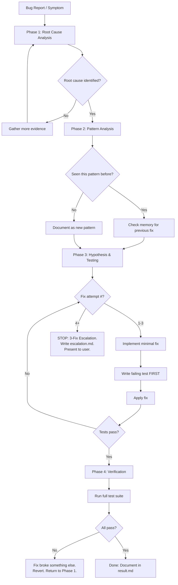

# Systematic Debugging — Mandatory Skill

**Agent:** Analyst (Phase 1: Investigation), Builder (Phase 2: Fix)
**Phase:** DEBUG workflow — all phases
**Priority:** CRITICAL — This skill is NON-NEGOTIABLE during DEBUG workflow

---

## IRON LAW

**NO FIXES WITHOUT ROOT CAUSE INVESTIGATION FIRST.**

Do not guess. Do not "try something." Do not apply the first fix that comes to mind.
Investigate. Understand. Then fix.

---

## The 4-Phase Debugging Process



---

## Phase 1: Root Cause Analysis

**Objective:** Understand WHY the bug exists, not just WHAT it does.

### Mandatory Steps

1. **Reproduce the bug.** If you can't reproduce it, you don't understand it.
   - Write exact steps to trigger the bug.
   - Note environment details (browser, OS, Node version, config).
   - Confirm reproduction is consistent (try 3 times).

2. **Gather evidence.** Do NOT hypothesize until you have data.
   - Read error messages and stack traces verbatim.
   - Check logs for the time window around the failure.
   - Run `git log --since="2 days ago" --oneline` to find recent changes.
   - Check memory/patterns.md for similar past issues.

3. **Trace the data flow backward.**
   - Start at the failure point (the error/wrong output).
   - Walk backward through the code: what function called this? What data did it pass?
   - At each step, verify the data is what you expect.
   - The first place where data diverges from expectation is likely the root cause.

4. **Identify the root cause.**
   - The root cause is the EARLIEST point in the chain where behavior diverges from specification.
   - "The button doesn't work" is a symptom. "The event handler references a stale closure" is a root cause.

### Phase 1 Gate
Before proceeding to Phase 2, you MUST have:
- [ ] Reproduction steps (tested and consistent)
- [ ] Evidence collected (logs, errors, stack traces)
- [ ] Root cause identified (specific code location and mechanism)
- [ ] Root cause explains ALL symptoms (not just some)

---

## Phase 2: Pattern Analysis

**Objective:** Determine if this bug is an instance of a known pattern.

### Steps

1. **Check memory.** Read `.opencode/context/01_memory/patterns.md`:
   - Has this exact bug occurred before?
   - Has a similar class of bug occurred? (e.g., "stale closure" bugs)
   - What was the previous fix? Did it work?

2. **Classify the bug type:**
   - **Logic error:** Wrong algorithm, wrong condition, off-by-one
   - **State management:** Stale state, race condition, missing update
   - **Integration:** API contract mismatch, data format mismatch
   - **Environment:** Config, dependency version, platform difference
   - **Regression:** Worked before, broken by recent change

3. **Document the pattern** for future reference.

### Phase 2 Gate
Before proceeding to Phase 3, you MUST have:
- [ ] Memory checked for similar past issues
- [ ] Bug classified by type
- [ ] If recurring pattern: previous fix reviewed for effectiveness

---

## Phase 3: Hypothesis & Testing

**Objective:** Fix the bug using the scientific method — one variable at a time.

### The Scientific Method for Debugging

1. **State your hypothesis clearly:**
   > "The bug occurs because [specific mechanism]. Fixing [specific thing] should resolve it because [reasoning]."

2. **Write a failing test FIRST** (TDD integration):
   - The test must reproduce the bug.
   - Run the test: it MUST fail (proves the test catches the bug).

3. **Make ONE minimal change.**
   - Change exactly one thing.
   - If you change multiple things, you won't know which one fixed it.

4. **Run the test.** Does it pass?
   - **Yes:** Proceed to Phase 4.
   - **No:** Revert. Formulate a new hypothesis. Try again.

5. **Track your attempts:**

   | Attempt | Hypothesis | Change Made | Result |
   |---------|-----------|-------------|--------|
   | 1 | ... | ... | FAIL/PASS |
   | 2 | ... | ... | FAIL/PASS |
   | 3 | ... | ... | FAIL/PASS |

### The 3-Fix Escalation Rule

**After 3 failed fix attempts, STOP.**

Do not attempt a 4th fix. Instead:

1. **Write `escalation.md`** in the task folder:
   ```markdown
   # Escalation Report
   ## Bug: [description]
   ## Root Cause: [what we think]
   ## Attempts:
   1. [what we tried] → [why it failed]
   2. [what we tried] → [why it failed]
   3. [what we tried] → [why it failed]
   ## Assessment:
   - Is the root cause actually correct? [reassess]
   - Is this a symptom of a deeper architectural problem?
   - Do we need to redesign this component?
   ## Recommendation: [what the human should decide]
   ```

2. **Present to the user.** The human decides:
   - Try a different approach
   - Redesign the component
   - Accept the bug as known limitation
   - Bring in different expertise

**Why 3 attempts?** After 3 failures, the probability that you're wrong about the root cause exceeds the probability of finding the right fix by iteration. Going back to Phase 1 is more productive than a 4th attempt.

### Phase 3 Gate
Before proceeding to Phase 4, you MUST have:
- [ ] Failing test written that reproduces the bug
- [ ] Fix implemented (single, minimal change)
- [ ] Failing test now passes with the fix applied

---

## Phase 4: Verification

**Objective:** Confirm the fix works and doesn't break anything else.

### Steps

1. **Run the specific regression test.** Must pass.
2. **Run the full test suite.** Must pass.
3. **Run typecheck.** Must pass.
4. **Regression check:**
   - Revert the fix temporarily.
   - Run the regression test. It MUST FAIL (proves the test actually catches the bug).
   - Restore the fix. Test must pass again.
5. **Check for side effects:**
   - Did the fix change any public API?
   - Did the fix change any data format?
   - Could the fix affect other features?

### Phase 4 Gate
Before claiming the bug is fixed, you MUST have:
- [ ] Regression test passes with fix
- [ ] Regression test fails without fix (revert check)
- [ ] Full test suite passes
- [ ] Typecheck passes
- [ ] No side effects identified (or documented)

---

## Backward Data Flow Tracing Technique

When the failure point is known but the cause is not:

```
1. Start at the ERROR/WRONG OUTPUT
   ↓
2. What function produced this output?
   ↓
3. What data did it receive as input?
   ↓
4. Is the input correct? 
   → YES: The bug is in this function. Inspect logic.
   → NO: Go to step 2 for the function that produced the bad input.
   ↓
5. Repeat until you find the FIRST function with wrong output
   despite correct input. That's the root cause.
```

### Example
```
Error: User sees "NaN" in price display
← PriceDisplay component renders `props.price`
← props.price comes from useCart() hook
← useCart() calculates: items.reduce((sum, item) => sum + item.price * item.qty, 0)
← item.price is a string "29.99" (not a number!)
← Item was deserialized from API without type coercion
ROOT CAUSE: API response parser doesn't convert price strings to numbers
```

---

## Human Signal Detection

The user's words contain diagnostic information. Watch for:

| User Says | What It Means | Your Action |
|-----------|--------------|-------------|
| "Stop guessing" | You skipped Phase 1 | Return to Phase 1. Gather evidence. |
| "That's not what's happening" | Your root cause is wrong | Return to Phase 1. Discard hypothesis. |
| "It was working before" | Regression. Check git history. | `git log`, `git bisect` |
| "It only happens sometimes" | Timing/race condition | Add logging, check async code |
| "It works locally but not in CI" | Environment difference | Compare configs, versions |
| "I already tried that" | You're repeating failed approaches | Read escalation history. Try new angle. |

---

## Rationalization Table

| What You'll Think | Why It's Wrong |
|---|---|
| "I think I know what's wrong — let me just try this quick fix." | Thinking ≠ knowing. Get evidence first. Quick fixes that are wrong waste more time than investigation. |
| "Let me try one more fix" (after 3 attempts) | If 3 attempts failed, your understanding of the problem is wrong. More attempts won't help. Escalate. |
| "The bug is obvious." | If it were obvious, it wouldn't be a bug. It survived code review, testing, and deployment. Respect it. |
| "I'll add more logging later." | Add logging NOW. You need the data NOW. Later is never. |
| "This is probably a library bug." | 99% of bugs are in YOUR code. Check your code first. Exhaust all local causes before blaming dependencies. |
| "I'll just work around it." | Workarounds are technical debt. They compound. Fix the root cause or document the decision with the user. |
| "The test is too hard to write for this bug." | If you can't test it, you can't verify the fix. Write the test or accept you haven't fixed it. |
| "It works on my machine." | Then the bug is in the environment delta. Find it. |

---

## Multi-Component Diagnostic Instrumentation

When debugging across system boundaries:

```typescript
// Add timestamped boundary logging at EACH component boundary
// Pattern: [COMPONENT:OPERATION:STATUS] data timestamp
console.log(`[API:REQUEST:START] ${endpoint} params=${JSON.stringify(params)} t=${Date.now()}`);
const result = await fetch(endpoint);
console.log(`[API:REQUEST:END] ${endpoint} status=${result.status} t=${Date.now()}`);

// Then trace the request through all components:
// [Router:DISPATCH:START] → [Service:PROCESS:START] → [DB:QUERY:START] → [DB:QUERY:END] → ...
```

---

## Skill Application Rule

**If there is even a 1% chance this skill applies to your current task, USE IT.**

This skill applies to:
- Any bug report or unexpected behavior
- Any failing test (investigate WHY it fails before fixing)
- Any regression (investigate what changed)
- Performance issues (profile first, then fix)
- Flaky tests (they have root causes too)

This skill does NOT apply to:
- New feature implementation (use TDD skill instead)
- Code review (use code-reviewer skill instead)
- Documentation changes
