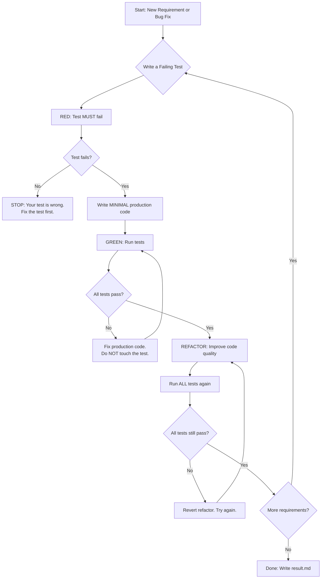

# Test-Driven Development (TDD) — Mandatory Skill

**Agent:** Builder (primary), Janitor (verification)
**Phase:** BUILD Phase 3 (Implementation), DEBUG Phase 2 (Fix)
**Priority:** CRITICAL — This skill is NON-NEGOTIABLE

---

## IRON LAW

**NO PRODUCTION CODE WITHOUT A FAILING TEST FIRST.**

This is not a guideline. This is not a suggestion. This is not "when practical."
This is an absolute rule with zero exceptions.

---

## The RED → GREEN → REFACTOR Cycle



### Phase Details

#### RED Phase
1. Write exactly ONE test that describes the behavior you want.
2. Run the test. It MUST fail.
3. If the test passes immediately, you have a problem:
   - The feature already exists (check before writing).
   - Your test is not testing the right thing.
   - You wrote production code first (delete it).

#### GREEN Phase
1. Write the MINIMUM code to make the failing test pass.
2. "Minimum" means: ugly, duplicated, hardcoded — all acceptable at this stage.
3. Do NOT write "clean" code yet. Do NOT refactor. Do NOT add features.
4. Run ALL tests (not just the new one). Every test must pass.

#### REFACTOR Phase
1. Now improve the code: extract functions, remove duplication, improve names.
2. Run ALL tests after EVERY refactor step. If a test fails, REVERT immediately.
3. Refactoring MUST NOT change behavior. Tests prove this.

---

## The Delete-and-Restart Rule

**If you wrote production code before writing the test: DELETE THE PRODUCTION CODE.**

Not "keep it as reference." Not "I'll write the test now." DELETE IT.

Why? Because:
- You will unconsciously shape the test to match the code you already wrote.
- The test becomes a description of your implementation, not a specification of behavior.
- You lose the design benefit of TDD — tests drive the interface, not the other way around.

### What "Delete" Means
- `git checkout -- <file>` or manually remove the code.
- Do NOT keep a copy in comments, clipboard, or another file.
- Start fresh. Write the test. Then write the code to pass it.

---

## Rationalization Table

| What You'll Think | Why It's Wrong |
|---|---|
| "I'll write tests after — same result." | No. You'll unconsciously shape tests to match existing code, missing edge cases and alternative designs. |
| "This is so simple it doesn't need a test." | Simple code in complex systems breaks in complex ways. The test takes 30 seconds. Write it. |
| "I'm just refactoring, not adding features." | Refactoring without tests is hoping. Tests prove behavior is preserved. |
| "The test is obvious — I'll skip straight to code." | If it's obvious, writing it takes 10 seconds. If you skip it, you skip the design thinking. |
| "I need to spike/prototype first." | Spikes are fine. But spike code MUST be deleted before real implementation. Then: test first. |
| "Oracle/contract said to skip tests." | Oracle CANNOT override TDD. No agent can. If the contract contradicts TDD, write `questions.md` and STOP. |
| "I already know exactly what the code looks like." | Knowing what to write ≠ having proof it works. The test IS the proof. |
| "Tests slow me down." | Debugging code without tests slows you down 10x more. TDD is faster, not slower. |
| "I'll write a big integration test later." | Integration tests catch integration bugs. Unit tests catch unit bugs. You need both. Write the unit test now. |
| "This is a UI component — hard to test." | Test the logic, not the pixels. Extract logic into testable functions. |
| "I'm under time pressure." | TDD under pressure produces working code. Code-first under pressure produces bugs under pressure. |

---

## Red Flags — If You Notice These, STOP

1. **Test passes immediately after writing.** You either didn't write it first, or it's testing nothing.
2. **You're writing production code and thinking "I should add a test for this."** Too late. Delete the code. Test first.
3. **You have more production code than test code.** Ratio should be roughly 1:1 or tests > production.
4. **You're debugging production code.** If you had a test, you'd know exactly what broke. Write the test now.
5. **You're refactoring without running tests between changes.** Each refactor step must be verified.
6. **You wrote a test that tests implementation details** (e.g., "function was called 3 times"). Test behavior, not implementation.
7. **You skipped the RED phase** because "you know it will fail." Run it anyway. Verify your assumption.

---

## Good vs. Bad Examples (TypeScript)

### BAD: Code First, Test After

```typescript
// BAD: Builder writes this first
export function calculateDiscount(price: number, tier: 'gold' | 'silver' | 'bronze'): number {
  const rates = { gold: 0.2, silver: 0.1, bronze: 0.05 };
  return price * (1 - rates[tier]);
}

// BAD: Then writes a test that matches the implementation
test('calculateDiscount', () => {
  // This test was shaped by looking at the code, not by thinking about requirements
  expect(calculateDiscount(100, 'gold')).toBe(80);    // Just mirrors the rates object
  expect(calculateDiscount(100, 'silver')).toBe(90);
  expect(calculateDiscount(100, 'bronze')).toBe(95);
  // Missing: What about negative prices? Unknown tiers? Zero price?
});
```

### GOOD: Test First, Code After

```typescript
// GOOD: Step 1 — Write the test FIRST (RED)
describe('calculateDiscount', () => {
  test('applies 20% discount for gold tier', () => {
    expect(calculateDiscount(100, 'gold')).toBe(80);
  });

  test('applies 10% discount for silver tier', () => {
    expect(calculateDiscount(100, 'silver')).toBe(90);
  });

  test('applies 5% discount for bronze tier', () => {
    expect(calculateDiscount(100, 'bronze')).toBe(95);
  });

  test('throws on negative price', () => {
    expect(() => calculateDiscount(-1, 'gold')).toThrow('Price must be non-negative');
  });

  test('throws on unknown tier', () => {
    // @ts-expect-error — testing runtime safety
    expect(() => calculateDiscount(100, 'platinum')).toThrow('Unknown tier');
  });

  test('returns 0 for zero price', () => {
    expect(calculateDiscount(0, 'gold')).toBe(0);
  });
});

// GOOD: Step 2 — Tests fail (RED confirmed). Now write minimal code (GREEN)
export function calculateDiscount(price: number, tier: 'gold' | 'silver' | 'bronze'): number {
  if (price < 0) throw new Error('Price must be non-negative');
  const rates: Record<string, number> = { gold: 0.2, silver: 0.1, bronze: 0.05 };
  if (!(tier in rates)) throw new Error('Unknown tier');
  return price * (1 - rates[tier]);
}
```

Notice: The test-first approach naturally discovered edge cases (negative prices, unknown tiers, zero price) that the code-first approach missed.

---

## Verification Checklist (Before Writing result.md)

Builder MUST verify ALL of the following before claiming task completion:

- [ ] **1. Every production function has at least one test.**
  Run: `grep -r "test\|it\|describe" <test-files> | wc -l` and compare with production functions.

- [ ] **2. Tests were written BEFORE production code.**
  Evidence: git log shows test commits before or in same commit as production code.

- [ ] **3. All tests pass.**
  Run: `bun test` or `vitest run` — paste full output in result.md.

- [ ] **4. Typecheck passes.**
  Run: `npx tsc --noEmit` — paste output in result.md.

- [ ] **5. No test tests implementation details.**
  Review: tests should assert on outputs/behavior, not internal function calls or private state.

- [ ] **6. Edge cases are covered.**
  Check: null/undefined inputs, empty arrays, boundary values, error conditions.

- [ ] **7. Refactoring was done with tests green.**
  If you refactored: all tests passed before AND after.

- [ ] **8. Delete-and-restart rule was followed.**
  Confirm: no production code was written before its corresponding test.

---

## Integration with DEBUG Workflow

When a bug is reported:
1. **Write a failing test that reproduces the bug.** This IS the RED phase.
2. **Fix the code to make the test pass.** This IS the GREEN phase.
3. **Refactor if needed.** This IS the REFACTOR phase.

The bug fix IS a TDD cycle. Do not treat bugs as exceptions to TDD.

After fixing:
- Run the regression test to confirm the bug is fixed (GREEN).
- Revert the fix temporarily. Confirm the test fails again (validates the test catches the bug).
- Restore the fix. Confirm the test passes again.

---

## Integration with Verification Gate

Before claiming completion, the Builder MUST also execute the Verification Gate
(see `skills/verification-gate/SKILL.md`):

1. IDENTIFY: "I claim all requirements are implemented with passing tests."
2. RUN: Execute `bun test` and `npx tsc --noEmit` RIGHT NOW.
3. READ: Read the actual output (not from memory).
4. VERIFY: Does the output prove the claim?
5. CLAIM: Only now write PASS in result.md.

---

## Skill Application Rule

**If there is even a 1% chance this skill applies to your current task, USE IT.**

TDD applies to:
- New features (always)
- Bug fixes (always — write failing test first)
- Refactoring (always — need tests to verify behavior preservation)
- Configuration changes (if they affect runtime behavior)
- API changes (always)

TDD does NOT apply to:
- Documentation-only changes
- Comment-only changes
- Static asset additions (images, fonts)
- NSO orchestration file edits (prompts, skills, instructions)
